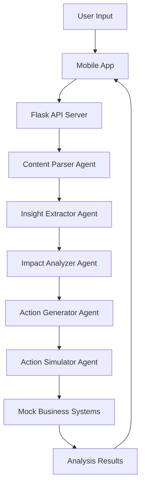

# 🚀 OmniTask Agentic App

**Transform Unstructured Data into Actionable Business Intelligence**

Welcome to **OmniTask**, an advanced agentic AI system built for high-stakes problem solving. It utilizes a state-of-the-art multi-step pipeline of AI agents to autonomously ingest complex business reports, extract critical insights, analyze systemic risks, and simulate real-world mitigation actions. 

## 🌟 Key Features

- **6-Agent Intelligence Pipeline**: Orchestrated workflow powered by Google Gemini, capable of complex reasoning and task execution.
- **Real-time Visualization**: Watch the agents think, plan, and act in real-time through an interactive UI.
- **Mock Simulation Layer**: Simulated CRM, Notification, and Dashboard systems to tangibly demonstrate business impact.
- **Premium Mobile UI**: Built with React Native Expo, featuring a modern glassmorphism design, Luma-inspired themes, and rich micro-animations.
- **Decision Transparency**: Complete, audit-ready trace logs for every AI decision made across the pipeline.

## 🏗️ Architecture

## 🛠️ Tech Stack

- **Frontend**: React Native, Expo, Expo Linear Gradient
- **Backend**: Python, Flask, Flask-CORS
- **AI Engine**: Google Gemini 3.1 Flash-Lite (via Google GenAI SDK)
- **Database**: SQLite (History & Trace Tracking)
- **Orchestration**: Google Antigravity

## 🚀 Getting Started

### 1. Prerequisites
- Node.js (v18+)
- Python (3.10+)
- Gemini API Key

### 2. Backend Setup
1. Navigate to the backend directory: `cd backend`
2. Install dependencies: `pip install -r requirements.txt`
3. Add your API key to `.env`: `GEMINI_API_KEY=your_key_here`
4. Start the server: `python app.py`

### 3. Mobile App Setup
1. Navigate to the mobile directory: `cd mobile`
2. Install dependencies: `npm install`
3. Start the app: `npx expo start --web`

## 📊 Sample Scenarios
The app comes pre-loaded with three realistic business scenarios:
1. **Sales Crisis (Lahore Region)**: Regional decline with rising complaints.
2. **Supply Chain Disruption**: Fuel price hikes impacting logistics.
3. **Import Tariff Policy**: Government policy changes on electronics.

## 🏆 Hackathon Submission Notes
This project demonstrates **agentic reasoning** by showing how raw text leads to specific, simulated actions with measurable impact. All agent decisions are logged in the **Agent Trace** screen for judge review.
